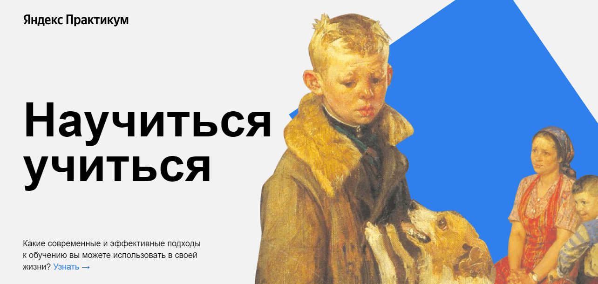

# Научиться учиться - Одностраничный сайт :purple_heart:
---
***Содержание файла README.md***

 
<a href="#description">Описание</a> 
<a href="#demo">Демонстрация</a> 
<a href="#file_structure">Файловая структура</a> 
<a href="#technologies">Использованные технологии</a> 

<h2>Описание</h2> 

Данный проект реализован в рамках курсов от Яндекс.Практикум и представляет собой типовой одностраничный сайт.

<h3>Структура главной страницы</h3> 

Главная страница состоит из 11-ти блоков: 
header, description, techniques, video, oakley, feynman, digits, khan, kaufman, resources, footer.

<h2>Демонстрация</h2> 

Ссылка на сайт <a href="https://almatanastasia.github.io/How-to-learn/">тут</a> !
 

<h2>Файловая структура</h2> 
<pre>
.
├── blocks          # Файлы стилей блоков 
├── images          # Файлы изображений 
├── pages           # Файлы стилей страниц 
├── texts           # Файлы текстов 
├── vendor          # Файлы сторонних библиотек 
├── .nojekyll       # Пустой файл для публикации на GitHub Pages 
├── README.md       # Файл документации проекта 
└── index.html      # Главная страница сайта 
</pre>

<h2>Использованные технологии</h2> 

⬥ Флексбокс-вёрстка  
⬥ Позиционирование  
⬥ Продвинутая семантика языка HTML  
⬥ Файловая структура CSS по методолгии БЭМ (Nested) 
⬥ Анимации и трансформации  
⬥ video, iframe (фрейм), embed, YouTube API  

